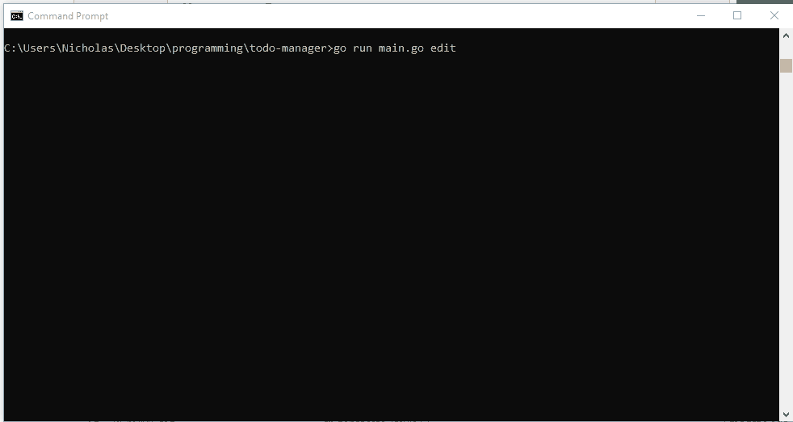

# todo-manager    
    
a boring CLI TODO manager in Go using [spf13/cobra](https://github.com/spf13/cobra) and [survey](https://github.com/AlecAivazis/survey)    
    
right now not very useful at all and keeps track of tasks in txt files :/    
    
    