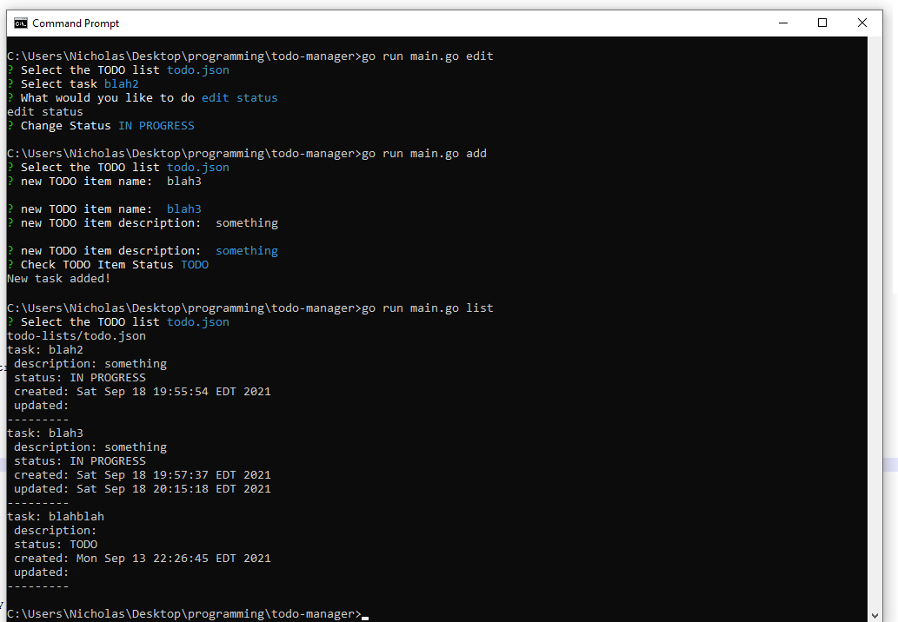

# todo-manager    
    
a boring CLI TODO manager in Go using [spf13/cobra](https://github.com/spf13/cobra) and [survey](https://github.com/AlecAivazis/survey)    
    
currently just lets you add and edit TODO info (name, description and status of tasks) in JSON files :)    
    
    